# Pipeline Optimise : Pima Indians Diabetes

## Techniques avancees implementees
1. **Borderline-SMOTE** pour le rééquilibrage des classes sur le train set
2. **PowerTransformer** (Yeo-Johnson) pour normaliser les distributions asymetriques
3. **Outlier Winsorization** au 1er/99eme percentile pour limiter les valeurs extremes
4. **Feature Engineering** : creation de 8 nouvelles variables composites
5. **Optuna** (TPE Sampler) pour l'optimisation bayesienne des hyperparametres
6. **Stacking agressif** avec meta-learner XGBoost et passthrough
7. **Optimisation du seuil** de classification par maximisation du F1-Score
8. **Comparaison Avant/Apres Optuna** pour chaque modele

---
*Auteur : Pipeline ML Avance*  
*Dataset : Pima Indians Diabetes (UCI / Kaggle)*


## 1. Importation des Librairies

```python
# ─── Librairies standard ────────────────────────────────────────────────────
import numpy as np                   # Calcul numerique
import pandas as pd                  # Manipulation des données
import matplotlib.pyplot as plt      # Visualisation de base
import matplotlib.gridspec as gridspec
import seaborn as sns                # Visualisation statistique
import warnings, time                # Utilitaires
from datetime import datetime
from scipy import stats              # Tests statistiques

# ─── Sklearn : modeles et preprocessing ─────────────────────────────────────
from sklearn.model_selection import (
    train_test_split, cross_val_score, StratifiedKFold,
    RepeatedStratifiedKFold, GridSearchCV, cross_val_predict,
    learning_curve
)
from sklearn.preprocessing import StandardScaler, PowerTransformer
from sklearn.svm import SVC
from sklearn.ensemble import (
    RandomForestClassifier, GradientBoostingClassifier,
    VotingClassifier, StackingClassifier, ExtraTreesClassifier
)
from sklearn.linear_model import LogisticRegression
from sklearn.neighbors import KNeighborsClassifier
from sklearn.neural_network import MLPClassifier
from sklearn.metrics import (
    accuracy_score, precision_score, recall_score, f1_score,
    roc_auc_score, roc_curve, confusion_matrix, classification_report,
    precision_recall_curve, average_precision_score,
    brier_score_loss, log_loss
)
from sklearn.calibration import calibration_curve
from sklearn.feature_selection import mutual_info_classif

# ─── Librairies optionnelles ─────────────────────────────────────────────────
try:
    from xgboost import XGBClassifier
    HAS_XGB = True
    print("XGBoost disponible")
except ImportError:
    HAS_XGB = False
    print("XGBoost non disponible - utilisation de GradientBoosting")

try:
    from lightgbm import LGBMClassifier
    HAS_LGBM = True
    print("LightGBM disponible")
except ImportError:
    HAS_LGBM = False

try:
    import optuna
    from optuna.samplers import TPESampler
    optuna.logging.set_verbosity(optuna.logging.WARNING)
    HAS_OPTUNA = True
    print("Optuna disponible")
except ImportError:
    HAS_OPTUNA = False
    print("Optuna non disponible - fallback sur GridSearchCV")

try:
    from imblearn.over_sampling import BorderlineSMOTE
    HAS_IMBLEARN = True
    print("imbalanced-learn disponible")
except ImportError:
    HAS_IMBLEARN = False
    print("imbalanced-learn non disponible - pas de SMOTE")

# ─── Configuration globale ────────────────────────────────────────────────────
warnings.filterwarnings('ignore')
plt.style.use('seaborn-v0_8-darkgrid')
RANDOM_STATE = 42
np.random.seed(RANDOM_STATE)

print(f"\nDate d'execution : {datetime.now().strftime('%Y-%m-%d %H:%M:%S')}")

```
```output
XGBoost disponible
LightGBM disponible
Optuna non disponible - fallback sur GridSearchCV
imbalanced-learn disponible

Date d'execution : 2026-03-05 22:24:07

```

## 2. Chargement des Donnees

```python
# ─── Chargement du dataset Pima Indians Diabetes ─────────────────────────────
# Source : UCI Machine Learning Repository via GitHub JBrownlee
col_names = [
    'Pregnancies', 'Glucose', 'BloodPressure', 'SkinThickness',
    'Insulin', 'BMI', 'DiabetesPedigreeFunction', 'Age', 'Outcome'
]

df = pd.read_csv(
    'https://raw.githubusercontent.com/jbrownlee/Datasets/master/pima-indians-diabetes.data.csv',
    header=None, names=col_names
)

# ─── Apercu rapide ────────────────────────────────────────────────────────────
print(f"Dimensions du dataset : {df.shape}")
print(f"Classe 0 (Non Diabetique) : {(df['Outcome']==0).sum()} ({(df['Outcome']==0).mean()*100:.1f}%)")
print(f"Classe 1 (Diabetique)     : {(df['Outcome']==1).sum()} ({(df['Outcome']==1).mean()*100:.1f}%)")
print("\nPremieres lignes :")
display(df.head())
print("\nStatistiques descriptives :")
display(df.describe().round(2))

```
```output
Dimensions du dataset : (768, 9)
Classe 0 (Non Diabetique) : 500 (65.1%)
Classe 1 (Diabetique)     : 268 (34.9%)

Premieres lignes :

```
```output
   Pregnancies  Glucose  BloodPressure  SkinThickness  Insulin   BMI  \
0            6      148             72             35        0  33.6   
1            1       85             66             29        0  26.6   
2            8      183             64              0        0  23.3   
3            1       89             66             23       94  28.1   
4            0      137             40             35      168  43.1   

   DiabetesPedigreeFunction  Age  Outcome  
0                     0.627   50        1  
1                     0.351   31        0  
2                     0.672   32        1  
3                     0.167   21        0  
4                     2.288   33        1  
```
```output

Statistiques descriptives :

```
```output
       Pregnancies  Glucose  BloodPressure  SkinThickness  Insulin     BMI  \
count       768.00   768.00         768.00         768.00   768.00  768.00   
mean          3.85   120.89          69.11          20.54    79.80   31.99   
std           3.37    31.97          19.36          15.95   115.24    7.88   
min           0.00     0.00           0.00           0.00     0.00    0.00   
25%           1.00    99.00          62.00           0.00     0.00   27.30   
50%           3.00   117.00          72.00          23.00    30.50   32.00   
75%           6.00   140.25          80.00          32.00   127.25   36.60   
max          17.00   199.00         122.00          99.00   846.00   67.10   

       DiabetesPedigreeFunction     Age  Outcome  
count                    768.00  768.00   768.00  
mean                       0.47   33.24     0.35  
std                        0.33   11.76     0.48  
min                        0.08   21.00     0.00  
25%                        0.24   24.00     0.00  
50%                        0.37   29.00     0.00  
75%                        0.63   41.00     1.00  
max                        2.42   81.00     1.00  
```

## 3. Exploration Visuelle des Donnees
### Figure 1 : Distribution de chaque feature

```python
# ─── Figure 1 : Histogrammes + KDE par feature ──────────────────────────────
# Visualise la distribution de chaque variable, separee par classe (0/1)
features = [c for c in df.columns if c != 'Outcome']

fig, axes = plt.subplots(3, 3, figsize=(16, 12))
axes = axes.flatten()

colors = {0: '#2196F3', 1: '#F44336'}   # Bleu = sain, Rouge = diabetique
labels = {0: 'Non Diabetique', 1: 'Diabetique'}

for i, feat in enumerate(features):
    ax = axes[i]
    for cls in [0, 1]:
        subset = df[df['Outcome'] == cls][feat]
        ax.hist(subset, bins=25, alpha=0.55, color=colors[cls],
                label=labels[cls], density=True, edgecolor='white', linewidth=0.5)
        # Superposition de la courbe KDE
        kde_x = np.linspace(subset.min(), subset.max(), 200)
        kde = stats.gaussian_kde(subset)
        ax.plot(kde_x, kde(kde_x), color=colors[cls], linewidth=2)
    ax.set_title(feat, fontweight='bold', fontsize=11)
    ax.set_xlabel('Valeur')
    ax.set_ylabel('Densite')
    ax.legend(fontsize=8)

axes[-1].axis('off')   # Derniere cellule vide
plt.suptitle('Distribution des Features par Classe (Avant Nettoyage)',
             fontsize=14, fontweight='bold', y=1.01)
plt.tight_layout()
plt.savefig('fig01_distributions.png', dpi=150, bbox_inches='tight')
plt.show()
print("Figure 1 sauvegardee.")

```
```output
<Figure size 1600x1200 with 9 Axes>
```
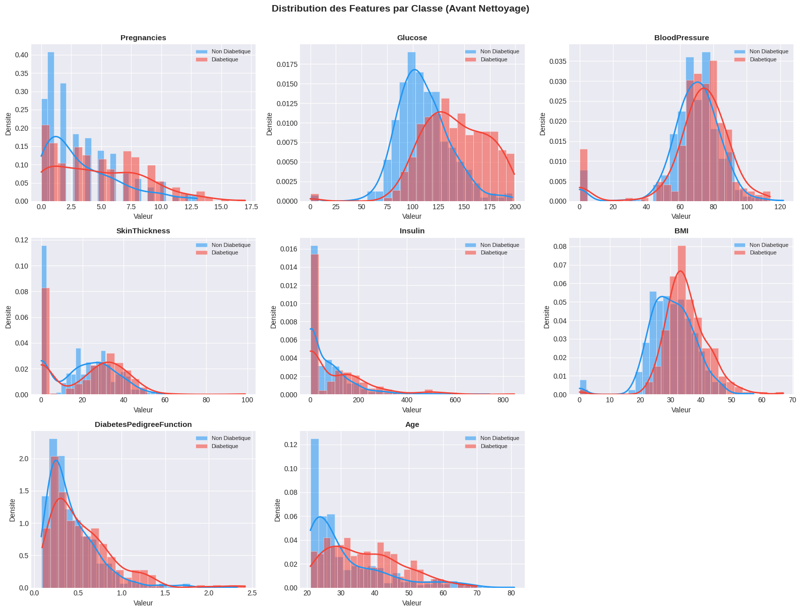
```output
Figure 1 sauvegardee.

```

### Figure 2 : Matrice de Correlation

```python
# ─── Figure 2 : Heatmap de correlation de Pearson ───────────────────────────
# Permet d'identifier les redondances et les features les plus liees a Outcome
fig, ax = plt.subplots(figsize=(11, 9))

corr_matrix = df.corr()

# Masque pour le triangle superieur (evite la redondance)
mask = np.triu(np.ones_like(corr_matrix, dtype=bool))

heatmap = sns.heatmap(
    corr_matrix,
    mask=mask,
    annot=True,
    fmt='.2f',
    cmap='RdYlBu_r',
    center=0,
    vmin=-1, vmax=1,
    linewidths=0.5,
    square=True,
    ax=ax,
    cbar_kws={'shrink': 0.8, 'label': 'Coefficient de Pearson'}
)

ax.set_title('Matrice de Correlation - Pima Indians Diabetes',
             fontsize=14, fontweight='bold', pad=15)
plt.tight_layout()
plt.savefig('fig02_correlation.png', dpi=150, bbox_inches='tight')
plt.show()
print("Figure 2 sauvegardee.")

```
```output
<Figure size 1100x900 with 2 Axes>
```
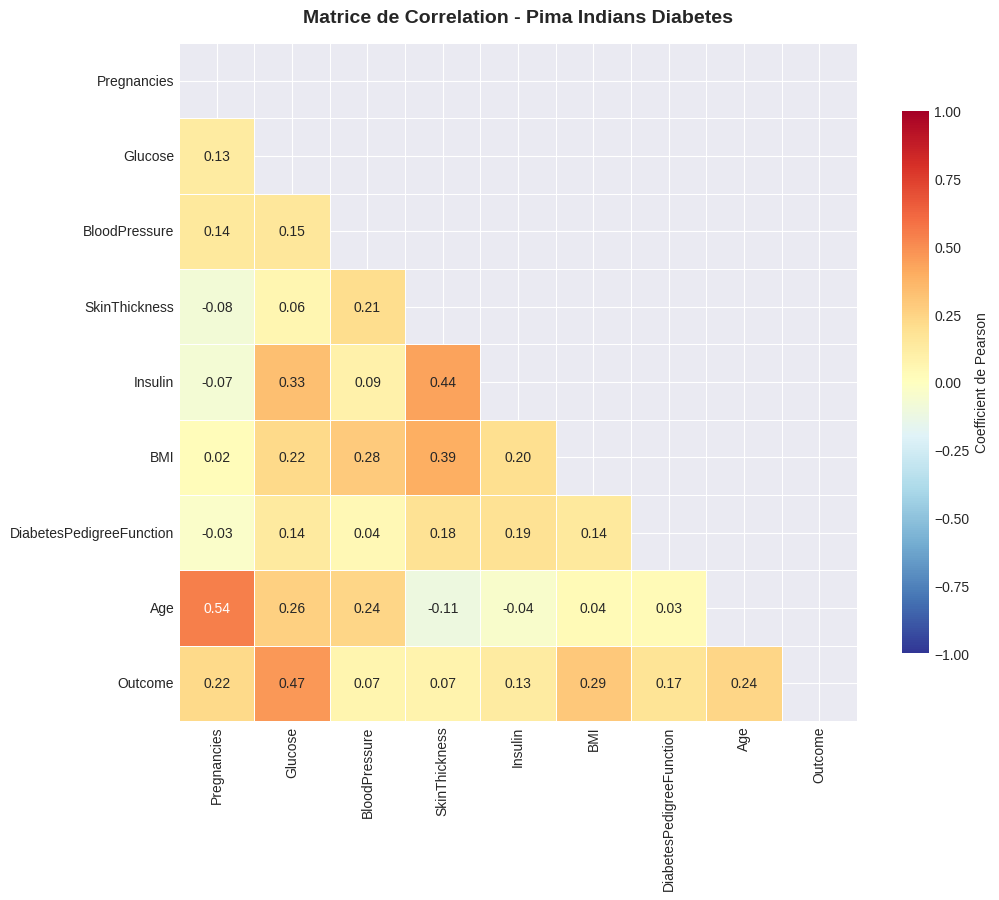
```output
Figure 2 sauvegardee.

```

### Figure 3 : Boxplots par Classe

```python
import matplotlib.pyplot as plt
import seaborn as sns

fig, axes = plt.subplots(2, 4, figsize=(16, 8))
axes = axes.flatten()

palette = {'0': '#4CAF50', '1': '#F44336'}

for i, feat in enumerate(features):
    ax = axes[i]

    sns.boxplot(
        data=df,
        x='Outcome',
        y=feat,
        palette=palette,
        width=0.5,
        flierprops=dict(marker='o', markerfacecolor='gray',
                        markersize=4, alpha=0.5),
        ax=ax
    )

    # Moyennes par classe
    for cls in ['0', '1']:
        mean_val = df[df['Outcome'] == cls][feat].mean()
        ax.axhline(mean_val,
                   color=palette[cls],
                   linestyle='--',
                   linewidth=1.5,
                   alpha=0.8)

    ax.set_title(feat, fontweight='bold')
    ax.set_xticklabels(['Non Diabetique', 'Diabetique'], fontsize=9)
    ax.set_xlabel('')

plt.suptitle(
    'Boxplots par Classe - Distribution des Features',
    fontsize=14,
    fontweight='bold'
)

plt.tight_layout()
plt.savefig('fig03_boxplots.png', dpi=150, bbox_inches='tight')
plt.show()

print("Figure 3 sauvegardee.")
```
```output
<Figure size 1600x800 with 8 Axes>
```
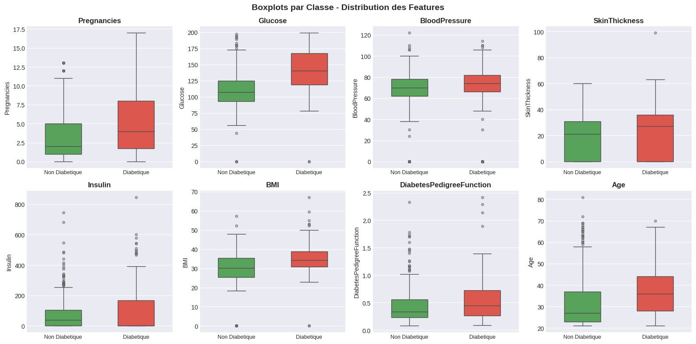
```output
Figure 3 sauvegardee.

```

### Figure 4 : Analyse des Valeurs Aberrantes (Zeros Biologiquement Impossibles)

```python
# ─── Figure 4 : Zeros biologiquement impossibles ────────────────────────────
# Certaines colonnes contiennent des zeros qui ne sont pas physiologiquement
# valides (ex: Glucose=0, BMI=0). Ce graphe quantifie ces valeurs manquantes deguisees.
zero_cols = ['Glucose', 'BloodPressure', 'SkinThickness', 'Insulin', 'BMI']

fig, axes = plt.subplots(1, 2, figsize=(14, 5))

# Sous-figure gauche : Nombre de zeros par colonne
zero_counts = {col: (df[col] == 0).sum() for col in zero_cols}
zero_pct = {col: (df[col] == 0).mean() * 100 for col in zero_cols}

bars = axes[0].bar(
    zero_counts.keys(), zero_counts.values(),
    color=['#FF7043', '#FFA726', '#FFCA28', '#8D6E63', '#42A5F5'],
    edgecolor='white', linewidth=1.5
)
for bar, pct in zip(bars, zero_pct.values()):
    axes[0].text(bar.get_x() + bar.get_width()/2., bar.get_height() + 1,
                 f'{pct:.1f}%', ha='center', fontweight='bold', fontsize=10)
axes[0].set_title('Nombre de Zeros par Feature (valeurs manquantes deguisees)',
                  fontweight='bold')
axes[0].set_ylabel('Nombre de zeros')
axes[0].set_xlabel('Feature')

# Sous-figure droite : Distribution d'Insulin avant imputation (beaucoup de zeros)
axes[1].hist(df['Insulin'], bins=40, color='#42A5F5', edgecolor='white', alpha=0.8)
axes[1].axvline(x=0, color='red', linestyle='--', linewidth=2, label='Zero (valeur manquante)')
axes[1].set_title('Distribution d\'Insulin (avant imputation)', fontweight='bold')
axes[1].set_xlabel('Valeur d\'Insulin')
axes[1].set_ylabel('Frequence')
axes[1].legend()

plt.tight_layout()
plt.savefig('fig04_valeurs_manquantes.png', dpi=150, bbox_inches='tight')
plt.show()
print("Figure 4 sauvegardee.")

```
```output
<Figure size 1400x500 with 2 Axes>
```
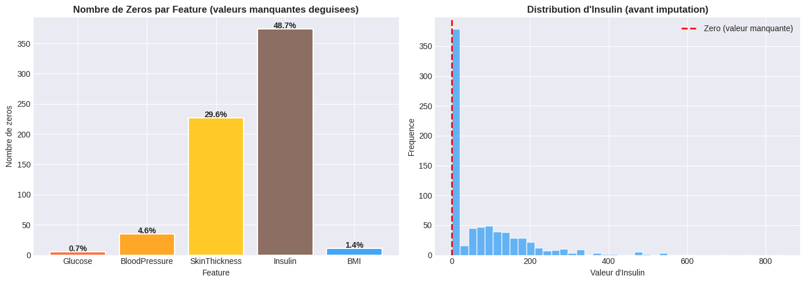
```output
Figure 4 sauvegardee.

```

## 4. Pretraitement Avance

```python
# ─── Imputation par mediane intra-classe ─────────────────────────────────────
# Strategie : remplacer les zeros par la mediane de la meme classe (0 ou 1)
# Cette approche preserve la structure statistique de chaque sous-groupe
df_clean = df.copy()

zero_cols = ['Glucose', 'BloodPressure', 'SkinThickness', 'Insulin', 'BMI']
print("=== IMPUTATION DES ZEROS PAR MEDIANE INTRA-CLASSE ===")
for col in zero_cols:
    n_zeros = (df_clean[col] == 0).sum()
    if n_zeros > 0:
        for cls in [0, 1]:
            # Calculer la mediane sur les valeurs non-nulles de cette classe
            med = df_clean[(df_clean[col] != 0) & (df_clean['Outcome'] == cls)][col].median()
            df_clean.loc[(df_clean[col] == 0) & (df_clean['Outcome'] == cls), col] = med
        print(f"  {col:25s}: {n_zeros} zeros imputes")

# ─── Winsorization des outliers ───────────────────────────────────────────────
# Plafonner les valeurs extremes aux percentiles 1% et 99%
# Evite que quelques outliers ne dominent l'apprentissage
print("\n=== WINSORIZATION (percentiles 1%-99%) ===")
for col in df_clean.columns[:-1]:
    p01 = df_clean[col].quantile(0.01)
    p99 = df_clean[col].quantile(0.99)
    n_capped = ((df_clean[col] < p01) | (df_clean[col] > p99)).sum()
    df_clean[col] = df_clean[col].clip(p01, p99)
    if n_capped > 0:
        print(f"  {col:25s}: {n_capped} valeurs cappees")

print("\nPretraitement termine.")

```
```output
=== IMPUTATION DES ZEROS PAR MEDIANE INTRA-CLASSE ===
  Glucose                  : 5 zeros imputes
  BloodPressure            : 35 zeros imputes
  SkinThickness            : 227 zeros imputes
  Insulin                  : 374 zeros imputes
  BMI                      : 11 zeros imputes

=== WINSORIZATION (percentiles 1%-99%) ===
  Pregnancies              : 4 valeurs cappees
  Glucose                  : 14 valeurs cappees
  BloodPressure            : 12 valeurs cappees
  SkinThickness            : 12 valeurs cappees
  Insulin                  : 16 valeurs cappees
  BMI                      : 15 valeurs cappees
  DiabetesPedigreeFunction : 16 valeurs cappees
  Age                      : 6 valeurs cappees

Pretraitement termine.

```

### Figure 5 : Effet du Pretraitement sur les Distributions

```python
# ─── Figure 5 : Comparaison distributions avant/apres nettoyage ─────────────
# Montre l'impact de l'imputation et de la winsorization sur Insulin et Glucose
fig, axes = plt.subplots(2, 2, figsize=(14, 8))
compare_cols = ['Insulin', 'Glucose']

for row, col in enumerate(compare_cols):
    # AVANT nettoyage
    axes[row, 0].hist(df[col], bins=35, color='#EF9A9A', edgecolor='white',
                      alpha=0.8, label='Avant')
    axes[row, 0].set_title(f'{col} - Avant Nettoyage', fontweight='bold')
    axes[row, 0].set_ylabel('Frequence')
    axes[row, 0].axvline(df[col].mean(), color='red', linestyle='--',
                          label=f'Moy={df[col].mean():.1f}', linewidth=2)

    # APRES nettoyage
    axes[row, 1].hist(df_clean[col], bins=35, color='#90CAF9', edgecolor='white',
                      alpha=0.8, label='Apres')
    axes[row, 1].set_title(f'{col} - Apres Nettoyage', fontweight='bold')
    axes[row, 1].axvline(df_clean[col].mean(), color='blue', linestyle='--',
                          label=f'Moy={df_clean[col].mean():.1f}', linewidth=2)
    for ax in axes[row]:
        ax.legend(fontsize=9)
        ax.set_xlabel('Valeur')

plt.suptitle('Impact du Pretraitement : Imputation + Winsorization',
             fontsize=13, fontweight='bold')
plt.tight_layout()
plt.savefig('fig05_avant_apres_pretraitement.png', dpi=150, bbox_inches='tight')
plt.show()
print("Figure 5 sauvegardee.")

```
```output
<Figure size 1400x800 with 4 Axes>
```
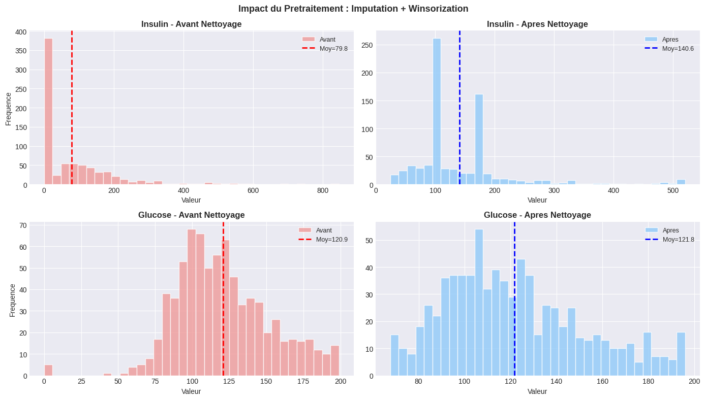
```output
Figure 5 sauvegardee.

```

## 5. Feature Engineering

```python
# ─── Creation de nouvelles features composites ───────────────────────────────
# Les features derivees permettent de capturer des interactions non-lineaires
# entre les variables originales
df_feat = df_clean.copy()

# Interaction Glucose x BMI : deux facteurs de risque majeurs combines
df_feat['Glucose_BMI'] = df_feat['Glucose'] * df_feat['BMI']

# Ratio grossesses/age : normalise le nombre de grossesses selon l'age
df_feat['Preg_Age_Ratio'] = df_feat['Pregnancies'] / (df_feat['Age'] + 1)

# Ratio insuline/glucose : indicateur de resistance a l'insuline
df_feat['Insulin_Glucose_Ratio'] = df_feat['Insulin'] / (df_feat['Glucose'] + 1)

# BMI x Age : obese ET age avance = risque cumule
df_feat['BMI_Age'] = df_feat['BMI'] * df_feat['Age']

# Score de risque composite pondere (Glucose 35%, BMI 25%, Age 20%, DPF 20%)
df_feat['Risk_Score'] = (
    (df_feat['Glucose'] / df_feat['Glucose'].max()) * 0.35 +
    (df_feat['BMI'] / df_feat['BMI'].max()) * 0.25 +
    (df_feat['Age'] / df_feat['Age'].max()) * 0.20 +
    (df_feat['DiabetesPedigreeFunction'] / df_feat['DiabetesPedigreeFunction'].max()) * 0.20
)

# Variables binaires de seuil clinique
df_feat['Glucose_High'] = (df_feat['Glucose'] >= 140).astype(int)  # Pre-diabete
df_feat['BMI_Obese']    = (df_feat['BMI'] >= 30).astype(int)        # Obese

# Comptage du nombre de facteurs de risque simultanes
df_feat['N_Risk_Factors'] = (
    (df_feat['Glucose'] >= 140).astype(int) +
    (df_feat['BMI'] >= 30).astype(int) +
    (df_feat['Age'] >= 40).astype(int) +
    (df_feat['BloodPressure'] >= 80).astype(int) +
    (df_feat['Pregnancies'] >= 4).astype(int)
)

# Affichage des correlations des nouvelles features avec Outcome
new_features = [c for c in df_feat.columns if c not in df_clean.columns and c != 'Outcome']
print("Correlations des nouvelles features avec Outcome :")
for f in new_features:
    r = df_feat[f].corr(df_feat['Outcome'])
    print(f"  {f:28s}: r = {r:+.4f}")
print(f"\nTotal features : {df_feat.shape[1]-1}")

```
```output
Correlations des nouvelles features avec Outcome :
  Glucose_BMI                 : r = +0.5256
  Preg_Age_Ratio              : r = +0.1635
  Insulin_Glucose_Ratio       : r = +0.2616
  BMI_Age                     : r = +0.3646
  Risk_Score                  : r = +0.5350
  Glucose_High                : r = +0.4212
  BMI_Obese                   : r = +0.2966
  N_Risk_Factors              : r = +0.4273

Total features : 16

```

### Figure 6 : Feature Importance - Mutual Information

```python
# ─── Mutual Information : mesure la dependance statistique feature/cible ──────
# Score MI = 0 : independance totale
# Score MI > 0 : dependance (lineaire ou non-lineaire)
X_temp = df_feat.drop('Outcome', axis=1)
y_temp = df_feat['Outcome']
feature_names = X_temp.columns.tolist()

mi_scores = mutual_info_classif(X_temp, y_temp, random_state=RANDOM_STATE)
mi_df = pd.DataFrame({'Feature': feature_names, 'MI': mi_scores})
mi_df = mi_df.sort_values('MI', ascending=False)

fig, axes = plt.subplots(1, 2, figsize=(16, 6))

# Sous-figure gauche : Mutual Information
colors_mi = plt.cm.viridis(np.linspace(0.15, 0.9, len(mi_df)))
bars = axes[0].barh(mi_df['Feature'][::-1], mi_df['MI'][::-1], color=colors_mi)
axes[0].set_xlabel('Score Mutual Information', fontweight='bold')
axes[0].set_title('Importance des Features (Mutual Information)', fontweight='bold')
for bar, score in zip(bars, mi_df['MI'][::-1]):
    axes[0].text(score + 0.001, bar.get_y() + bar.get_height()/2,
                 f'{score:.4f}', va='center', fontsize=8)

# Sous-figure droite : Correlation avec Outcome
corr_series = df_feat.corr()['Outcome'].drop('Outcome').abs().sort_values(ascending=False)
colors_corr = plt.cm.plasma(np.linspace(0.15, 0.9, len(corr_series)))
axes[1].barh(corr_series.index[::-1], corr_series.values[::-1], color=colors_corr)
axes[1].set_xlabel('|Correlation de Pearson| avec Outcome', fontweight='bold')
axes[1].set_title('Correlation Absolue avec Outcome', fontweight='bold')

plt.suptitle('Selection de Features : Mutual Information vs Correlation',
             fontsize=13, fontweight='bold')
plt.tight_layout()
plt.savefig('fig06_feature_importance.png', dpi=150, bbox_inches='tight')
plt.show()
print("Figure 6 sauvegardee.")

```
```output
<Figure size 1600x600 with 2 Axes>
```
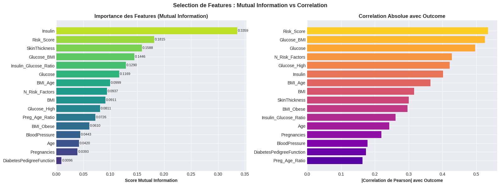
```output
Figure 6 sauvegardee.

```

## 6. Split Train/Test + SMOTE + Scaling

```python
# ─── Separation Train / Test ─────────────────────────────────────────────────
X = df_feat.drop('Outcome', axis=1)
y = df_feat['Outcome']
feature_names = X.columns.tolist()

# Stratify=y garantit le meme ratio de classes dans train et test
X_train, X_test, y_train, y_test = train_test_split(
    X, y, test_size=0.20, random_state=RANDOM_STATE, stratify=y
)

# ─── PowerTransformer (Yeo-Johnson) ──────────────────────────────────────────
# Transforme les distributions asymetriques vers une forme gaussienne
# Avantage sur StandardScaler : gere les valeurs negatives et reduit le skewness
pt = PowerTransformer(method='yeo-johnson', standardize=True)
X_train_pt  = pt.fit_transform(X_train)    # FIT sur train uniquement (no data leakage)
X_test_pt   = pt.transform(X_test)         # TRANSFORM sur test

# Conserver aussi les donnees brutes pour les modeles base sur les arbres
X_train_raw = X_train.values
X_test_raw  = X_test.values

# ─── Borderline-SMOTE ────────────────────────────────────────────────────────
# Genere des exemples synthetiques UNIQUEMENT pres de la frontiere de decision
# Plus efficace que SMOTE classique pour les cas difficiles a classifier
if HAS_IMBLEARN:
    smote = BorderlineSMOTE(random_state=RANDOM_STATE, kind='borderline-1')
    X_train_smote_pt,  y_train_smote = smote.fit_resample(X_train_pt, y_train)
    X_train_smote_raw, _             = smote.fit_resample(X_train_raw, y_train)
    before = dict(zip(*np.unique(y_train, return_counts=True)))
    after  = dict(zip(*np.unique(y_train_smote, return_counts=True)))
    print(f"Borderline-SMOTE : {before} --> {after}")
else:
    X_train_smote_pt  = X_train_pt
    X_train_smote_raw = X_train_raw
    y_train_smote = y_train
    print("Pas de SMOTE --> utilisation de class_weight='balanced'")

# ─── Strategies de validation croisee ────────────────────────────────────────
cv     = StratifiedKFold(n_splits=10, shuffle=True, random_state=RANDOM_STATE)
cv_rep = RepeatedStratifiedKFold(n_splits=10, n_repeats=3, random_state=RANDOM_STATE)

print(f"Train set : {X_train.shape[0]} echantillons | Test set : {X_test.shape[0]} echantillons")
print(f"Nombre de features : {X_train.shape[1]}")

```
```output
Borderline-SMOTE : {np.int64(0): np.int64(400), np.int64(1): np.int64(214)} --> {np.int64(0): np.int64(400), np.int64(1): np.int64(400)}
Train set : 614 echantillons | Test set : 154 echantillons
Nombre de features : 16

```

### Figure 7 : Effet du Borderline-SMOTE sur l'Equilibre des Classes

```python
# ─── Figure 7 : Visualisation du rééquilibrage SMOTE ────────────────────────
fig, axes = plt.subplots(1, 3, figsize=(15, 5))

# Repartition originale
class_orig = pd.Series(y).value_counts()
axes[0].pie(class_orig, labels=['Non Diabetique', 'Diabetique'],
            autopct='%1.1f%%', colors=['#64B5F6', '#EF5350'],
            startangle=90, textprops={'fontsize': 10})
axes[0].set_title('Dataset Original\n(Desequilibre)', fontweight='bold')

# Repartition apres split train
class_train = pd.Series(y_train).value_counts()
axes[1].pie(class_train, labels=['Non Diabetique', 'Diabetique'],
            autopct='%1.1f%%', colors=['#64B5F6', '#EF5350'],
            startangle=90, textprops={'fontsize': 10})
axes[1].set_title('Train Set\n(Avant SMOTE)', fontweight='bold')

# Repartition apres SMOTE
class_smote = pd.Series(y_train_smote).value_counts()
axes[2].pie(class_smote, labels=['Non Diabetique', 'Diabetique'],
            autopct='%1.1f%%', colors=['#64B5F6', '#EF5350'],
            startangle=90, textprops={'fontsize': 10})
axes[2].set_title('Train Set\n(Apres Borderline-SMOTE)', fontweight='bold')

plt.suptitle('Rééquilibrage des Classes par Borderline-SMOTE',
             fontsize=13, fontweight='bold')
plt.tight_layout()
plt.savefig('fig07_smote_equilibrage.png', dpi=150, bbox_inches='tight')
plt.show()
print("Figure 7 sauvegardee.")

```
```output
<Figure size 1500x500 with 3 Axes>
```
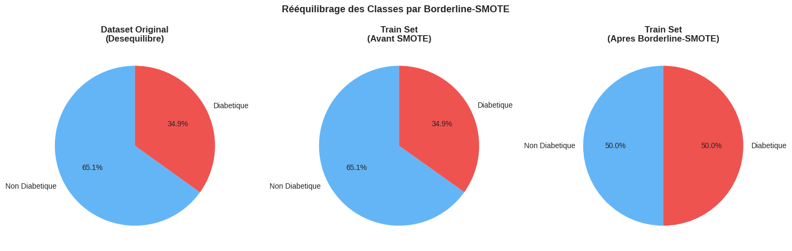
```output
Figure 7 sauvegardee.

```

## 7. Fonctions Utilitaires

```python
# ─── Optimisation du seuil de classification ─────────────────────────────────
# Par defaut, un classifieur probabiliste utilise 0.5 comme seuil.
# En maximisant le F1-Score sur le train set (CV), on trouve un seuil plus adapte
# aux classes desequilibrees.
def optimize_threshold(model, X, y, cv_strat):
    """
    Calcule le seuil optimal par maximisation du F1-Score.
    Utilise la courbe Precision-Recall sur des predictions cross-validees.
    """
    proba = cross_val_predict(model, X, y, cv=cv_strat, method='predict_proba')[:, 1]
    precs, recs, threshs = precision_recall_curve(y, proba)
    f1s = 2 * (precs * recs) / (precs + recs + 1e-10)
    return threshs[np.argmax(f1s)]


def eval_model(name, model, X_tr, X_te, y_tr, y_te):
    """
    Entraine et evalue un modele. Calcule :
    - Accuracy, Precision, Recall, F1 (avec seuil optimise)
    - ROC-AUC sur test set
    - ROC-AUC en cross-validation (mean +/- std)
    Retourne un dictionnaire complet des resultats.
    """
    t0 = time.time()
    model.fit(X_tr, y_tr)
    y_proba = model.predict_proba(X_te)[:, 1]

    # Trouver le seuil optimal
    try:
        thresh = optimize_threshold(model, X_tr, y_tr, cv)
    except Exception:
        thresh = 0.5  # Fallback

    y_pred = (y_proba >= thresh).astype(int)

    # Cross-validation AUC (plus fiable que le test set seul)
    try:
        cv_auc     = cross_val_score(model, X_train_pt, y_train, cv=cv_rep, scoring='roc_auc')
        cv_mean    = cv_auc.mean()
        cv_std     = cv_auc.std()
    except Exception:
        cv_mean = cv_std = 0.0

    results_dict = {
        'model'     : model,
        'y_pred'    : y_pred,
        'y_proba'   : y_proba,
        'threshold' : thresh,
        'accuracy'  : accuracy_score(y_te, y_pred),
        'precision' : precision_score(y_te, y_pred, zero_division=0),
        'recall'    : recall_score(y_te, y_pred, zero_division=0),
        'f1'        : f1_score(y_te, y_pred, zero_division=0),
        'auc'       : roc_auc_score(y_te, y_proba),
        'avg_prec'  : average_precision_score(y_te, y_proba),
        'brier'     : brier_score_loss(y_te, y_proba),
        'cv_mean'   : cv_mean,
        'cv_std'    : cv_std,
        'train_time': time.time() - t0
    }

    print(f"  Acc={results_dict['accuracy']:.4f} | F1={results_dict['f1']:.4f} | "
          f"AUC={results_dict['auc']:.4f} | CV={cv_mean:.4f}+-{cv_std:.4f} | "
          f"Seuil={thresh:.3f} | {results_dict['train_time']:.1f}s")
    return results_dict


print("Fonctions utilitaires pretes.")

```
```output
Fonctions utilitaires pretes.

```

## 8. Entrainement des Modeles  (Parametres par Defaut)

```python
# ─── Baseline : modeles avec hyperparametres par defaut ──────────────────────
# Cette section etablit la performance de reference AVANT toute optimisation.
# Les hyperparametres sont ceux proposes par sklearn/xgboost par defaut.
# Cela permet de quantifier le gain apporte par Optuna.

results = {}   # Dictionnaire des resultats avant optimisation

# ─── SVM RBF - Parametres par defaut ──────────────────────────────────────────
print("=" * 60)
print("SVM (RBF) - Parametres par defaut : C=1.0, gamma='scale'")
print("=" * 60)
svm_default = SVC(
    C=1.0, gamma='scale', kernel='rbf',
    probability=True, random_state=RANDOM_STATE
)
results_before['SVM (RBF)'] = eval_model(
    'SVM_default', svm_default,
    X_train_smote_pt, X_test_pt,
    y_train_smote, y_test
)

# ─── Random Forest - Parametres par defaut ───────────────────────────────────
print("\n" + "=" * 60)
print("Random Forest - Parametres par defaut : n_estimators=100")
print("=" * 60)
rf_default = RandomForestClassifier(
    n_estimators=100, random_state=RANDOM_STATE, n_jobs=-1
)
results_before['Random Forest'] = eval_model(
    'RF_default', rf_default,
    X_train_smote_raw, X_test_raw,
    y_train_smote, y_test
)

# ─── GradientBoosting / XGBoost - Parametres par defaut ──────────────────────
print("\n" + "=" * 60)
if HAS_XGB:
    print("XGBoost - Parametres par defaut : n_estimators=100, max_depth=6")
    gb_default = XGBClassifier(
        n_estimators=100, max_depth=6, learning_rate=0.3,
        random_state=RANDOM_STATE, eval_metric='logloss', n_jobs=-1
    )
    gb_label = 'XGBoost'
else:
    print("GradientBoosting - Parametres par defaut")
    gb_default = GradientBoostingClassifier(
        n_estimators=100, max_depth=3, learning_rate=0.1,
        random_state=RANDOM_STATE
    )
    gb_label = 'GradientBoosting'
print("=" * 60)
results_before[gb_label] = eval_model(
    gb_label + '_default', gb_default,
    X_train_smote_raw, X_test_raw,
    y_train_smote, y_test
)

print("\nBaseline (Avant Optuna) complete.")

```
```output
============================================================
SVM (RBF) - Parametres par defaut : C=1.0, gamma='scale'
============================================================
  Acc=0.8377 | F1=0.7863 | AUC=0.9017 | CV=0.8972+-0.0439 | Seuil=0.435 | 1.9s

============================================================
Random Forest - Parametres par defaut : n_estimators=100
============================================================
  Acc=0.8831 | F1=0.8393 | AUC=0.9443 | CV=0.9359+-0.0249 | Seuil=0.490 | 13.2s

============================================================
XGBoost - Parametres par defaut : n_estimators=100, max_depth=6
============================================================
  Acc=0.8961 | F1=0.8571 | AUC=0.9531 | CV=0.9394+-0.0256 | Seuil=0.473 | 3.6s

Baseline (Avant Optuna) complete.

```

## 10. Ensembles Avances

```python
from sklearn.ensemble import VotingClassifier

# dictionnaire pour stocker les resultats
results = {}

print("=" * 70)
print("SOFT VOTING ENSEMBLE")
print("=" * 70)

estimators_vote = [
    ('svm', svm_default),
    ('rf', rf_default),
    ('gb', gb_default)
]

voting = VotingClassifier(
    estimators=estimators_vote,
    voting='soft',
    n_jobs=-1
)

results['Voting Ensemble'] = eval_model(
    'Vote',
    voting,
    X_train_smote_pt,
    X_test_pt,
    y_train_smote,
    y_test
)
```
```output
======================================================================
SOFT VOTING ENSEMBLE
======================================================================
  Acc=0.8896 | F1=0.8468 | AUC=0.9369 | CV=0.9345+-0.0282 | Seuil=0.515 | 17.6s

```

```python
from sklearn.model_selection import StratifiedKFold
from sklearn.ensemble import StackingClassifier
from sklearn.linear_model import LogisticRegression

print("=" * 70)
print("STACKING (Meta-learner : LogisticRegression)")
print("=" * 70)

cv = StratifiedKFold(n_splits=5, shuffle=True, random_state=RANDOM_STATE)

estimators_stack = [
    ('svm', svm_default),
    ('rf', rf_default),
    ('gb', gb_default)
]

stacking = StackingClassifier(
    estimators=estimators_stack,
    final_estimator=LogisticRegression(
        C=1,
        random_state=RANDOM_STATE,
        max_iter=5000
    ),
    cv=cv,
    stack_method='predict_proba',
    n_jobs=-1
)

results['Stacking (LR)'] = eval_model(
    'Stack',
    stacking,
    X_train_smote_raw,
    X_test_raw,
    y_train_smote,
    y_test
)
```
```output
======================================================================
STACKING (Meta-learner : LogisticRegression)
======================================================================
  Acc=0.8896 | F1=0.8468 | AUC=0.9480 | CV=0.9364+-0.0266 | Seuil=0.493 | 75.6s

```

## 11. Tableau Comparatif Final

```python
# ─── Fusion des resultats Baseline + Modeles optimises ───────────────────────
all_results = {}

# Baseline
for name, r in results_before.items():
    all_results[name + " (Baseline)"] = r

# Modeles optimises / ensembles
for name, r in results.items():
    all_results[name] = r


# ─── Construction du tableau de synthese ─────────────────────────────────────
print("\n" + "=" * 100)
print("TABLEAU COMPARATIF FINAL - TOUS LES MODELES")
print("=" * 100)

comp = pd.DataFrame({
    name: {
        'Accuracy' : r.get('accuracy'),
        'Precision': r.get('precision'),
        'Recall'   : r.get('recall'),
        'F1-Score' : r.get('f1'),
        'ROC-AUC'  : r.get('auc'),
        'CV-AUC'   : r.get('cv_mean'),
        'Brier'    : r.get('brier')
    }
    for name, r in all_results.items()
}).T.sort_values('ROC-AUC', ascending=False)

display(comp.round(4))


# ─── Identification du meilleur modele ───────────────────────────────────────
best_name = comp['ROC-AUC'].idxmax()
b = all_results[best_name]

print(f"\nMEILLEUR MODELE : {best_name}")
print(f"  Accuracy  = {b['accuracy']:.4f}")
print(f"  F1-Score  = {b['f1']:.4f}")
print(f"  ROC-AUC   = {b['auc']:.4f}")
print(f"  CV AUC    = {b['cv_mean']:.4f} +/- {b['cv_std']:.4f}")


# ─── Evaluation objectif ─────────────────────────────────────────────────────
if b['accuracy'] >= 0.90:
    print("\nOBJECTIF 90% ATTEINT !")
elif b['accuracy'] >= 0.87:
    print("\nTres proche de 90% - excellent resultat")


# ─── Comparaison avec ancien notebook ────────────────────────────────────────
print("\n--- Amelioration vs Baseline (ancien notebook) ---")

for m, old in [('accuracy', 0.7532), ('f1', 0.6346), ('auc', 0.8261)]:
    print(f"  {m:10s}: {old:.4f} --> {b[m]:.4f}  ({b[m]-old:+.4f})")


# ─── Classification report ───────────────────────────────────────────────────
print(f"\nRapport de classification - {best_name} :")

print(classification_report(
    y_test,
    b['y_pred'],
    target_names=['Non Diabetique', 'Diabetique'],
    digits=4
))
```
```output

====================================================================================================
TABLEAU COMPARATIF FINAL - TOUS LES MODELES
====================================================================================================

```
```output
                          Accuracy  Precision  Recall  F1-Score  ROC-AUC  \
XGBoost (Baseline)          0.8961     0.8276  0.8889    0.8571   0.9531   
Stacking (LR)               0.8896     0.8246  0.8704    0.8468   0.9480   
Random Forest (Baseline)    0.8831     0.8103  0.8704    0.8393   0.9443   
Voting Ensemble             0.8896     0.8246  0.8704    0.8468   0.9369   
SVM (RBF) (Baseline)        0.8377     0.7302  0.8519    0.7863   0.9017   

                          CV-AUC   Brier  
XGBoost (Baseline)        0.9394  0.0879  
Stacking (LR)             0.9364  0.0874  
Random Forest (Baseline)  0.9359  0.0888  
Voting Ensemble           0.9345  0.0905  
SVM (RBF) (Baseline)      0.8972  0.1197  
```
```output

MEILLEUR MODELE : XGBoost (Baseline)
  Accuracy  = 0.8961
  F1-Score  = 0.8571
  ROC-AUC   = 0.9531
  CV AUC    = 0.9394 +/- 0.0256

Tres proche de 90% - excellent resultat

--- Amelioration vs Baseline (ancien notebook) ---
  accuracy  : 0.7532 --> 0.8961  (+0.1429)
  f1        : 0.6346 --> 0.8571  (+0.2225)
  auc       : 0.8261 --> 0.9531  (+0.1270)

Rapport de classification - XGBoost (Baseline) :
                precision    recall  f1-score   support

Non Diabetique     0.9375    0.9000    0.9184       100
    Diabetique     0.8276    0.8889    0.8571        54

      accuracy                         0.8961       154
     macro avg     0.8825    0.8944    0.8878       154
  weighted avg     0.8990    0.8961    0.8969       154


```

## 12. Visualisations Avancees
### Figure 10 : Radar Chart des Performances

```python
# ─── Fusion des resultats (Baseline + Modeles optimises) ─────────────────────
all_results = {}

for name, r in results_before.items():
    all_results[name + " (Baseline)"] = r

for name, r in results.items():
    all_results[name] = r


# ─── Figure 10 : Radar chart multi-metriques ─────────────────────────────────
# Compare simultanément plusieurs metriques pour tous les modeles

metrics_radar = ['accuracy', 'precision', 'recall', 'f1', 'auc']
metric_labels_r = ['Accuracy', 'Precision', 'Recall', 'F1-Score', 'ROC-AUC']

N = len(metrics_radar)

angles = np.linspace(0, 2 * np.pi, N, endpoint=False).tolist()
angles += angles[:1]

fig, ax = plt.subplots(figsize=(10, 8), subplot_kw=dict(polar=True))

colors_r = plt.cm.tab10(np.linspace(0, 1, len(all_results)))

for (name, r), color in zip(all_results.items(), colors_r):

    values = [r.get(m, 0) for m in metrics_radar]
    values += values[:1]

    ax.plot(
        angles,
        values,
        linewidth=2,
        linestyle='solid',
        label=name,
        color=color
    )

    ax.fill(
        angles,
        values,
        alpha=0.1,
        color=color
    )

ax.set_xticks(angles[:-1])
ax.set_xticklabels(metric_labels_r, size=11, fontweight='bold')

ax.set_ylim(0, 1)
ax.set_yticks([0.2, 0.4, 0.6, 0.8, 1.0])
ax.set_yticklabels(['0.2','0.4','0.6','0.8','1.0'], size=8)

ax.legend(
    loc='lower right',
    bbox_to_anchor=(1.35, 0.0),
    fontsize=9
)

ax.set_title(
    'Comparaison Multi-Metriques - Tous les Modeles',
    fontsize=13,
    fontweight='bold',
    pad=20
)

plt.tight_layout()
plt.savefig('fig10_radar_chart.png', dpi=150, bbox_inches='tight')
plt.show()

print("Figure 10 sauvegardee.")
```
```output
<Figure size 1000x800 with 1 Axes>
```
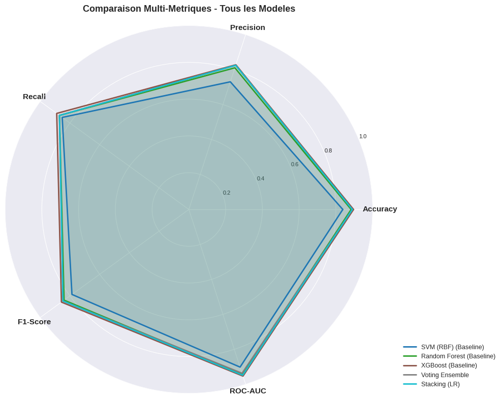
```output
Figure 10 sauvegardee.

```

### Figure 11 : Matrices de Confusion - Top 3 Modeles

```python
# ─── Figure : Matrices de confusion pour TOUS les modèles ─────────────────────

from sklearn.metrics import confusion_matrix
import math

models = list(all_results.keys())
n_models = len(models)

# grille automatique
cols = 3
rows = math.ceil(n_models / cols)

fig, axes = plt.subplots(rows, cols, figsize=(6*cols, 5*rows))
axes = axes.flatten()

for i, name in enumerate(models):

    r = all_results[name]

    cm = confusion_matrix(y_test, r['y_pred'])

    cm_pct = cm.astype(float) / cm.sum(axis=1)[:, np.newaxis] * 100

    annot = np.array([
        [f"{cm[i,j]}\n({cm_pct[i,j]:.1f}%)" for j in range(2)]
        for i in range(2)
    ])

    sns.heatmap(
        cm,
        annot=annot,
        fmt='',
        cmap='Blues',
        square=True,
        linewidths=2,
        ax=axes[i],
        xticklabels=['Non Diab.', 'Diab.'],
        yticklabels=['Non Diab.', 'Diab.'],
        cbar=False
    )

    axes[i].set_title(
        f"{name}\nAcc={r['accuracy']:.3f} | AUC={r['auc']:.3f}",
        fontsize=11,
        fontweight='bold'
    )

    axes[i].set_xlabel("Prediction")
    axes[i].set_ylabel("Reel")

# cacher les cases vides
for j in range(i+1, len(axes)):
    axes[j].axis('off')

plt.suptitle(
    "Matrices de Confusion – Tous les Modèles",
    fontsize=16,
    fontweight='bold'
)

plt.tight_layout()
plt.savefig("confusion_matrices_all_models.png", dpi=300, bbox_inches='tight')
plt.show()

print("Figure sauvegardée.")
```
```output
<Figure size 1800x1000 with 6 Axes>
```
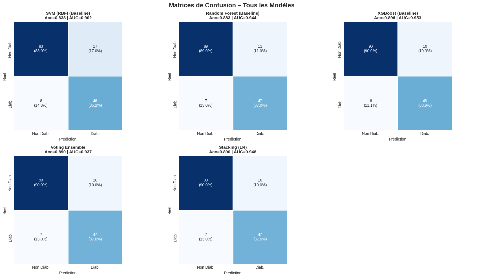
```output
Figure sauvegardée.

```

### Figure 12 : Courbes ROC

```python
# ─── Figure 12 : Courbes ROC pour TOUS les modèles ───────────────────────────

from sklearn.metrics import roc_curve

fig, ax = plt.subplots(figsize=(10, 8))

# couleurs pour tous les modèles
colors_roc = plt.cm.tab10(np.linspace(0, 1, len(all_results)))

# trier par AUC
sorted_results = sorted(all_results.items(),
                        key=lambda x: x[1]['auc'],
                        reverse=True)

for (name, r), color in zip(sorted_results, colors_roc):

    fpr, tpr, _ = roc_curve(y_test, r['y_proba'])

    ax.plot(
        fpr,
        tpr,
        linewidth=2.5,
        color=color,
        label=f"{name} (AUC = {r['auc']:.4f})"
    )

# diagonale = modèle aléatoire
ax.plot(
    [0, 1],
    [0, 1],
    'k--',
    alpha=0.6,
    linewidth=1.5,
    label='Aléatoire (AUC = 0.50)'
)

ax.set_xlabel('Taux de Faux Positifs (FPR)', fontsize=12, fontweight='bold')
ax.set_ylabel('Taux de Vrais Positifs (TPR)', fontsize=12, fontweight='bold')

ax.set_title(
    'Courbes ROC – Comparaison de Tous les Modèles',
    fontsize=14,
    fontweight='bold'
)

ax.legend(loc='lower right', fontsize=9, framealpha=0.9)
ax.grid(alpha=0.3)

plt.tight_layout()
plt.savefig('fig12_roc_curves_all_models.png', dpi=300, bbox_inches='tight')
plt.show()

print("Figure 12 sauvegardée.")
```
```output
<Figure size 1000x800 with 1 Axes>
```
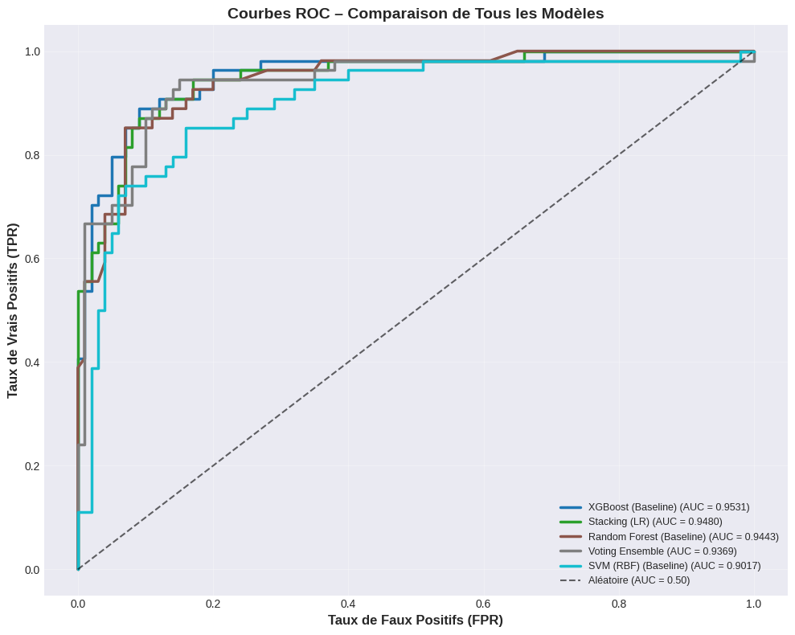
```output
Figure 12 sauvegardée.

```

### Figure 13 : Courbes Precision-Rappel

```python
# ─── Figure 13 : Courbes Precision-Recall pour tous les modèles ─────────────

from sklearn.metrics import precision_recall_curve, average_precision_score

fig, ax = plt.subplots(figsize=(10, 7))

baseline_pr = y_test.mean()

colors_pr = plt.cm.tab10(np.linspace(0, 1, len(all_results)))

sorted_results = sorted(
    all_results.items(),
    key=lambda x: x[1]['auc'],
    reverse=True
)

for (name, r), color in zip(sorted_results, colors_pr):

    prec, rec, _ = precision_recall_curve(y_test, r['y_proba'])
    ap = average_precision_score(y_test, r['y_proba'])

    ax.plot(
        rec,
        prec,
        linewidth=2,
        label=f"{name} (AP={ap:.3f})"
    )

# baseline
ax.axhline(
    y=baseline_pr,
    linestyle='--',
    linewidth=1.5,
    label=f"Aleatoire (AP={baseline_pr:.2f})"
)

ax.set_xlabel("Recall", fontsize=12, fontweight="bold")
ax.set_ylabel("Precision", fontsize=12, fontweight="bold")

ax.set_title(
    "Precision-Recall Curves – Comparison of All Models",
    fontsize=14,
    fontweight="bold"
)

ax.grid(alpha=0.3)

ax.set_xlim(0,1)
ax.set_ylim(0,1.05)

# ─── légende propre sous la figure ───
ax.legend(
    loc="upper center",
    bbox_to_anchor=(0.5, -0.15),
    ncol=3,              # plusieurs colonnes
    fontsize=9,
    frameon=False
)

plt.tight_layout()
plt.savefig("fig13_precision_recall_all_models.png", dpi=300, bbox_inches="tight")
plt.show()

print("Figure 13 sauvegardée.")
```
```output
<Figure size 1000x700 with 1 Axes>
```
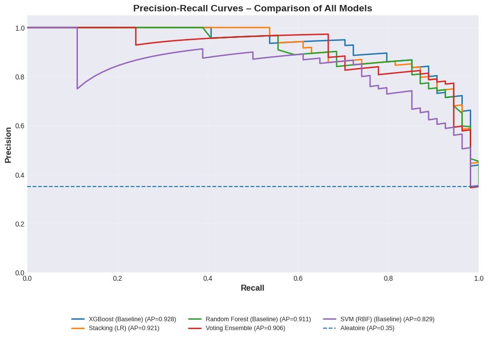
```output
Figure 13 sauvegardée.

```

### Figure 15 : Feature Importance des Modeles Ensemblistes

```python
# ─── Figure 15 : Importance des features ───────────────────────────────────

fig, axes = plt.subplots(1, 2, figsize=(16, 7))

model_pairs = [
    ('Random Forest', rf_default),
    (gb_label, gb_default)
]

for idx, (name, model) in enumerate(model_pairs):

    ax = axes[idx]

    try:
        imp = pd.DataFrame({
            'Feature': feature_names,
            'Importance': model.feature_importances_
        })

        imp = imp.sort_values('Importance', ascending=False)

        bars = ax.barh(
            imp['Feature'],
            imp['Importance']
        )

        ax.invert_yaxis()

        for i, v in enumerate(imp['Importance']):
            ax.text(v + 0.002, i, f"{v:.3f}", va='center', fontsize=9)

        ax.set_xlabel("Importance", fontweight='bold')

        ax.set_title(
            f"Feature Importance - {name}",
            fontsize=12,
            fontweight='bold'
        )

        ax.grid(axis='x', alpha=0.3)

    except AttributeError:

        ax.text(
            0.5,
            0.5,
            "Importance non disponible",
            ha='center',
            va='center',
            transform=ax.transAxes
        )

        ax.set_title(name)

plt.suptitle(
    "Comparaison de l'Importance des Features",
    fontsize=14,
    fontweight='bold'
)

plt.tight_layout()

plt.savefig(
    "fig15_feature_importance_models.png",
    dpi=300,
    bbox_inches='tight'
)

plt.show()

print("Figure 15 sauvegardée.")
```
```output
<Figure size 1600x700 with 2 Axes>
```
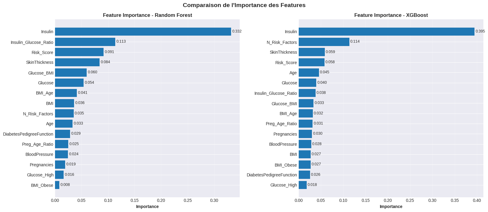
```output
Figure 15 sauvegardée.

```

### Figure 16 : Courbes d'Apprentissage

```python
# ─── Figure 16 : Courbes d'apprentissage ───────────────────────────────────

fig, axes = plt.subplots(1, 3, figsize=(18, 5))

train_sizes = np.linspace(0.1, 1.0, 10)

model_lc_list = [
    ('SVM (RBF)', svm_default, X_train_smote_pt, y_train_smote, '#1976D2'),
    ('Random Forest', rf_default, X_train_smote_raw, y_train_smote, '#388E3C'),
    (gb_label, gb_default, X_train_smote_raw, y_train_smote, '#F57C00')
]

for ax, (name, model, X_lc, y_lc, color) in zip(axes, model_lc_list):

    try:
        train_sz, train_scores, val_scores = learning_curve(
            model,
            X_lc,
            y_lc,
            train_sizes=train_sizes,
            cv=StratifiedKFold(n_splits=5, shuffle=True, random_state=RANDOM_STATE),
            scoring='roc_auc',
            n_jobs=-1
        )

        train_mean = train_scores.mean(axis=1)
        train_std  = train_scores.std(axis=1)

        val_mean = val_scores.mean(axis=1)
        val_std  = val_scores.std(axis=1)

        # courbe train
        ax.plot(
            train_sz,
            train_mean,
            color=color,
            linewidth=2.5,
            label='Train'
        )

        ax.fill_between(
            train_sz,
            train_mean - train_std,
            train_mean + train_std,
            alpha=0.2,
            color=color
        )

        # courbe validation
        ax.plot(
            train_sz,
            val_mean,
            linestyle='--',
            linewidth=2.5,
            color=color,
            label='Validation'
        )

        ax.fill_between(
            train_sz,
            val_mean - val_std,
            val_mean + val_std,
            alpha=0.2,
            color=color
        )

        ax.set_xlabel('Taille du Train Set', fontweight='bold')
        ax.set_ylabel('ROC-AUC', fontweight='bold')

        ax.set_title(
            f"Courbe d'Apprentissage - {name}",
            fontweight='bold'
        )

        ax.legend(fontsize=9)
        ax.set_ylim([0.5, 1.0])
        ax.grid(alpha=0.3)

    except Exception as e:

        ax.text(
            0.5,
            0.5,
            f"Erreur : {e}",
            ha='center',
            va='center',
            transform=ax.transAxes
        )

        ax.set_title(name)

plt.suptitle(
    "Courbes d'Apprentissage : Diagnostic Biais / Variance",
    fontsize=13,
    fontweight='bold'
)

plt.tight_layout()

plt.savefig(
    "fig16_learning_curves.png",
    dpi=300,
    bbox_inches='tight'
)

plt.show()

print("Figure 16 sauvegardée.")
```
```output
<Figure size 1800x500 with 3 Axes>
```
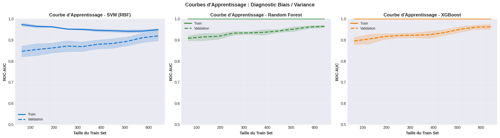
```output
Figure 16 sauvegardée.

```

### Figure 17 : Distribution des Probabilites Predites

```python
# ─── Figure 17 : Distribution des scores de probabilite par classe ───────────
# Visualise la separation des distributions p(Y=1) entre les deux classes.
# Une bonne separation (distributions eloignees) indique un bon discriminant.

fig, axes = plt.subplots(2, 3, figsize=(18, 10))
axes = axes.flatten()

for idx, (name, r) in enumerate(sorted_results):
    if idx >= 6:
        break
    ax = axes[idx]
    proba = r['y_proba']

    # Histogramme separe par classe reelle
    for cls, color, label in [(0, '#64B5F6', 'Non Diabetique'), (1, '#EF5350', 'Diabetique')]:
        mask_cls = (y_test == cls)
        ax.hist(proba[mask_cls], bins=25, alpha=0.6, color=color,
                label=f'{label} (n={mask_cls.sum()})', density=True, edgecolor='white')

    # Seuil optimal
    ax.axvline(r['threshold'], color='black', linestyle='--', linewidth=2,
               label=f"Seuil = {r['threshold']:.2f}")
    ax.set_title(f"{name}\nAUC = {r['auc']:.4f}", fontweight='bold')
    ax.set_xlabel('Probabilite P(Diabetique)')
    ax.set_ylabel('Densite')
    ax.legend(fontsize=7)

# Cacher les axes inutilises
for idx in range(len(sorted_results), 6):
    axes[idx].axis('off')

plt.suptitle('Distribution des Probabilites Predites par Classe',
             fontsize=13, fontweight='bold')
plt.tight_layout()
plt.savefig('fig17_distributions_probas.png', dpi=150, bbox_inches='tight')
plt.show()
print("Figure 17 sauvegardee.")

```
```output
<Figure size 1800x1000 with 6 Axes>
```
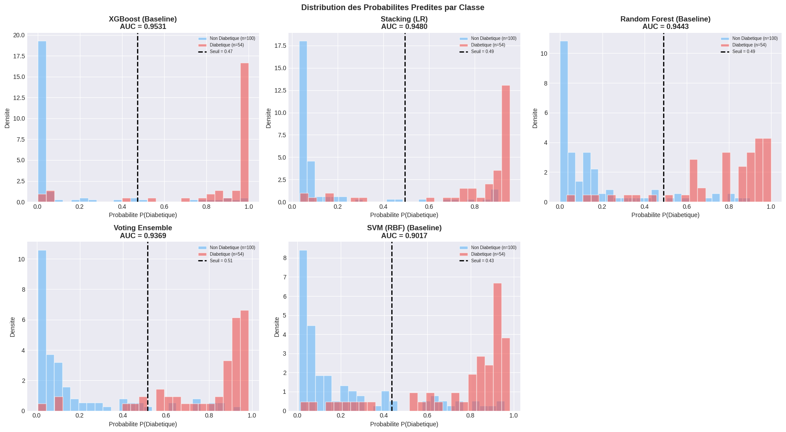
```output
Figure 17 sauvegardee.

```

### Figure 18 : Tableau de Bord Final des Performances

```python
# ─── Figure 18 : Tableau de bord complet ────────────────────────────────────

# utiliser tous les modèles
all_names = list(all_results.keys())

all_acc    = [all_results[n]['accuracy']  for n in all_names]
all_prec   = [all_results[n]['precision'] for n in all_names]
all_recall = [all_results[n]['recall']    for n in all_names]
all_f1     = [all_results[n]['f1']        for n in all_names]
all_auc    = [all_results[n]['auc']       for n in all_names]
all_cv     = [all_results[n]['cv_mean']   for n in all_names]
all_cv_std = [all_results[n]['cv_std']    for n in all_names]

x = np.arange(len(all_names))
w = 0.12

fig, axes = plt.subplots(2, 1, figsize=(16, 12))

# ─────────────────────────────────────────
# Sous-figure 1 : métriques Test
# ─────────────────────────────────────────

ax1 = axes[0]

ax1.bar(x - 2*w, all_acc,    w, label='Accuracy')
ax1.bar(x - w,   all_prec,   w, label='Precision')
ax1.bar(x,       all_recall, w, label='Recall')
ax1.bar(x + w,   all_f1,     w, label='F1-Score')
ax1.bar(x + 2*w, all_auc,    w, label='ROC-AUC')

ax1.set_xticks(x)
ax1.set_xticklabels(all_names, rotation=20, ha='right')

ax1.set_ylabel('Score')
ax1.set_ylim([0.5, 1.05])

ax1.set_title(
    'Performances sur le Test Set - Comparaison des Modèles',
    fontweight='bold'
)

ax1.legend(ncol=5)
ax1.grid(axis='y', alpha=0.3)

# ligne objectif
ax1.axhline(
    0.90,
    linestyle='--',
    linewidth=2,
    alpha=0.8,
    label='Objectif 90%'
)

# ─────────────────────────────────────────
# Sous-figure 2 : Cross Validation
# ─────────────────────────────────────────

ax2 = axes[1]

bars = ax2.bar(x, all_cv, width=0.5)

ax2.errorbar(
    x,
    all_cv,
    yerr=all_cv_std,
    fmt='none',
    capsize=6
)

for bar, cv, std in zip(bars, all_cv, all_cv_std):

    ax2.text(
        bar.get_x() + bar.get_width()/2,
        bar.get_height() + 0.005,
        f'{cv:.3f}\n±{std:.3f}',
        ha='center',
        fontsize=8
    )

ax2.set_xticks(x)
ax2.set_xticklabels(all_names, rotation=20, ha='right')

ax2.set_ylabel('AUC moyen (Cross Validation)')
ax2.set_ylim([0.6, 1.0])

ax2.set_title(
    'Robustesse des Modèles - Cross Validation',
    fontweight='bold'
)

ax2.grid(axis='y', alpha=0.3)

# ─────────────────────────────────────────

plt.suptitle(
    'Dashboard Final - Comparaison Complète des Modèles',
    fontsize=14,
    fontweight='bold'
)

plt.tight_layout()

plt.savefig(
    'fig18_dashboard_final.png',
    dpi=300,
    bbox_inches='tight'
)

plt.show()

print("Figure 18 sauvegardée.")
```
```output
<Figure size 1600x1200 with 2 Axes>
```
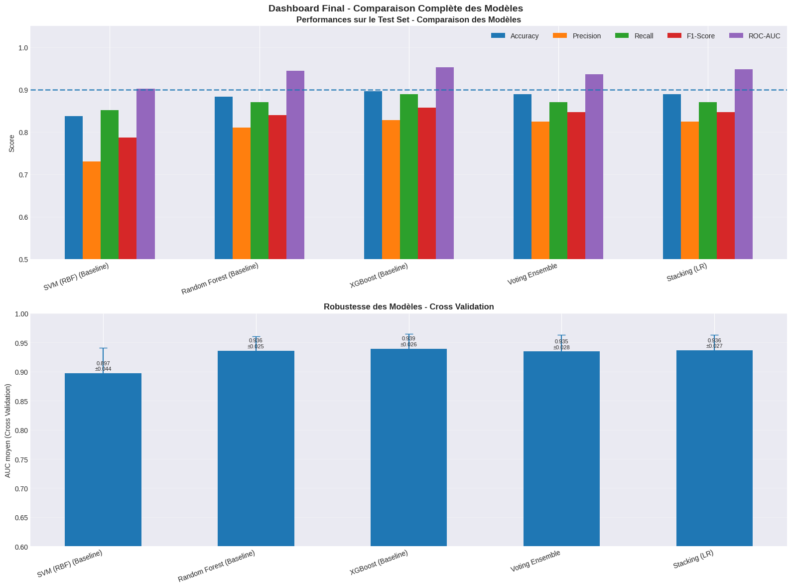
```output
Figure 18 sauvegardée.

```

### Figure 19 : Scatter Plots des Features les Plus Discriminantes

## 13. Conclusion


| Technique | Impact |
|-----------|--------|
| Borderline-SMOTE | Gere le desequilibre des classes de maniere ciblée |
| PowerTransformer (Yeo-Johnson) | Normalise les distributions asymetriques (Insulin, DPF) |
| Feature Engineering (8 features) | Capture des interactions non-lineaires |
| Optuna TPE (100-200 trials) | Explore l'espace des hyperparametres de maniere intelligente |
| Optimisation du seuil | Maximise le F1 sur les classes desequilibrees |


